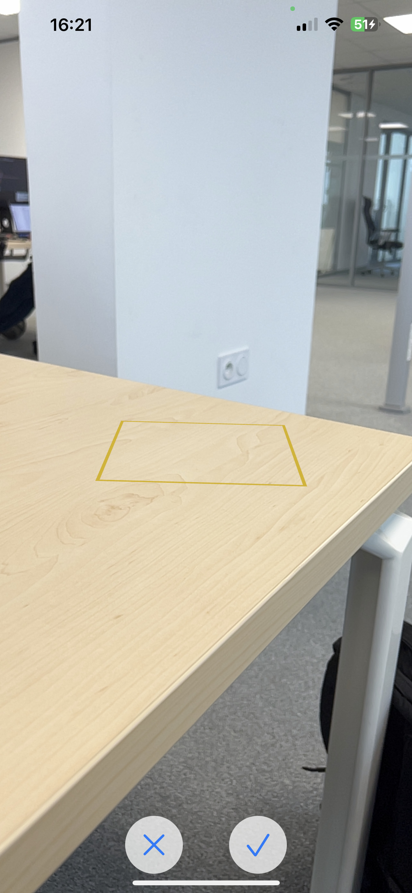

  

  

  
  
   

# ModelPickerApp
Discovery of Augmented Reality (AR) with ARKit and the [FocusEntity v2.3.0](https://github.com/maxxfrazer/FocusEntity) dependency package.  
This augmented reality application allows you to choose a model from among the different models offered by Apple and to integrate them while choosing the position of these models.

    
    
    

